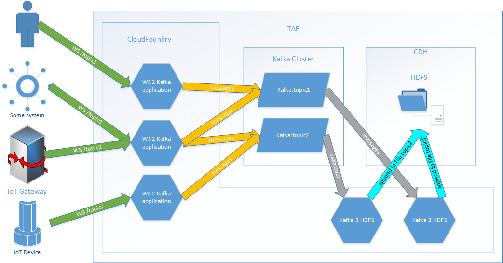

# A sample application for ingesting data through TAP and Kafka

This repository contains a sample application to show how TAP services can be connected. The following figure shows the flow for a data ingestion example using Apache Kafka.



## Implementation summary
* An external device/system pushes data through a WebSockets (WS) application hosted in TAP. Let's call this application **ws2kafka**. There can be multiple instances of this app.
* **ws2kafka** pushes recieved data into Kafka. The Kafka topic is chosen based on the WS URL to which the connection is made, so calls look like: ```wss://ws2kafka.some_domain.com/topic1```. For this to work, Kafka must be configured to automatically create topics. **ws2kafka** is horizontally scalable, so you can have multiple instances.
* **kafka2hdfs** is an application that is started with a predefined list of Kafka topics that it should track. For each topic, it ensures that a corresponding file exists and appends newly added data to it. (Since it is *not* safe to do multiple concurrent appends to a single HDFS file, you should avoid having multiple instances listening on the same topic.)

Instructions on how to deploy each application are included in that app's folder, with additional details. There is a small utility script ```create_service_instances.sh``` that creates service instances.

The provided **ws2kafka** application is very simple and does *not* provide authorization. If you need something more advanced, or you just feel adventurous, you may consider using [Gateway](https://github.com/trustedanalytics/gateway), but note that it enforces some Kafka messages format.

A handy feature of this pipeline is that you can replace one part of it with your own. The common part is Kafka and its topics.
